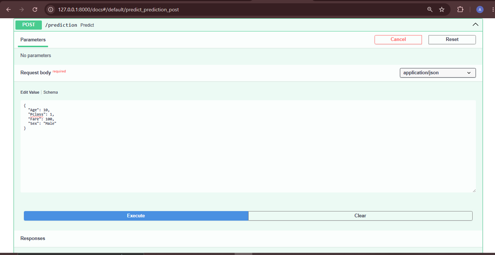
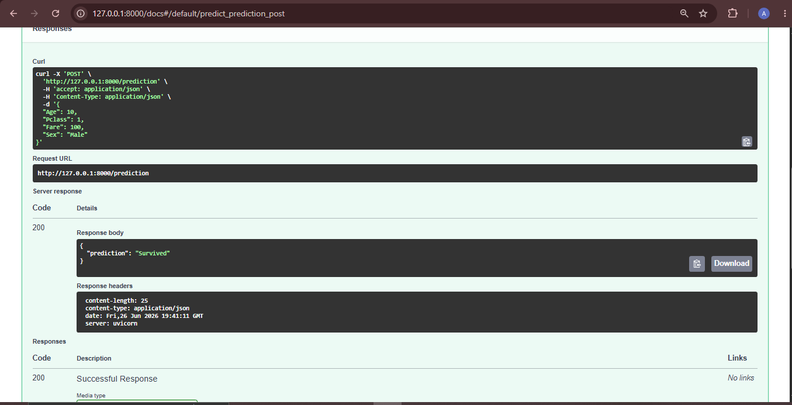

# Titanic Logistic Regression API

This project predicts whether a Titanic passenger survived or not using Logistic Regression.

## Features

- Logistic Regression model
- FastAPI backend
- StandardScaler for scaling
- LabelEncoder for Sex column
- Swagger UI for testing API

## Input Features

- Age
- Pclass
- Fare
- Sex

## API Endpoint

POST `/prediction`
## Example Input

```json
{
  "Age": 10,
  "Pclass": 1,
  "Fare": 100,
  "Sex": "Male"
}
```

## Example Output

```json
{
  "prediction": "Survived"
}
```

## Screenshots

### Swagger UI



### Successful Prediction


